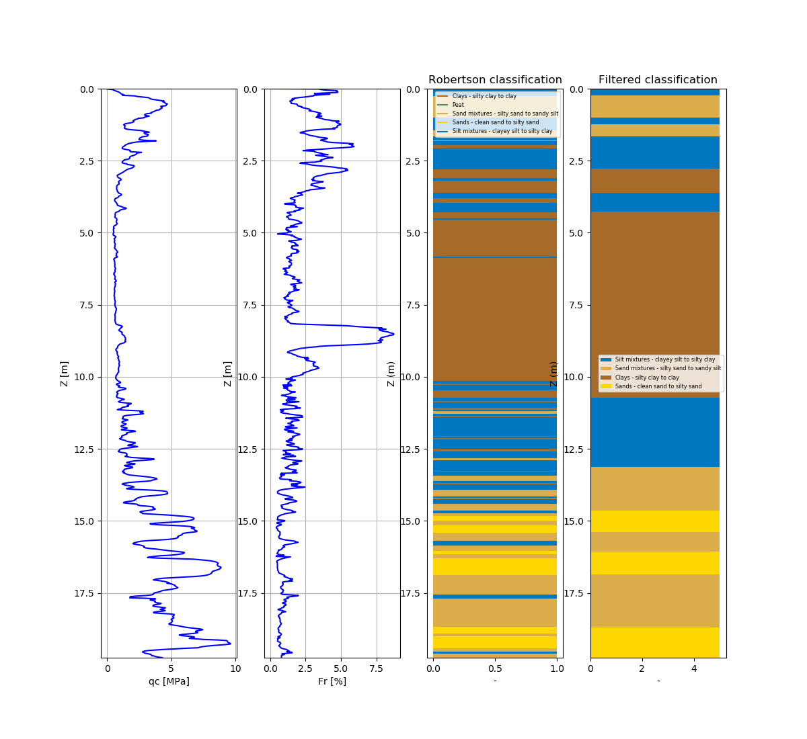

# PYGEF
[](https://travis-ci.org/ritchie46/pygef)
[](https://github.com/ambv/black)
[](https://pypi.org/project/pygef)
[](https://github.com/ritchie46/pygef)

Simple parser for *.gef files. These are ASCII based files used for soil properties measurements. 
Compatible with Python 3.7.

## Installation
`$ pip install pygef`

`$ pip install git+https://github.com/ritchie46/pygef.git`

### Read BORE and CPT files
```python
from pygef.gef import ParseGEF

# Read *.gef file
gef = ParseGEF("./my-gef-file.gef")
```


### Pandas dataframe is accessible via the `df` attribute
```python
print(gef.df)

# Save to csv
gef.df.to_csv("my-file.csv")
```

### A few of the GEF files attributes

* zid: *height with respect to NAP*
* type: *type of the gef file (borehole or cpt)*
* x: *RD coordinate*
* y: *RD coordinate*


### Plotting and classifications

```python
gef.plot(classification='robertson', water_level_NAP= -1, min_thickness= 0.2, show=True)  

# available classifications: robertson, been_jeffries
```




