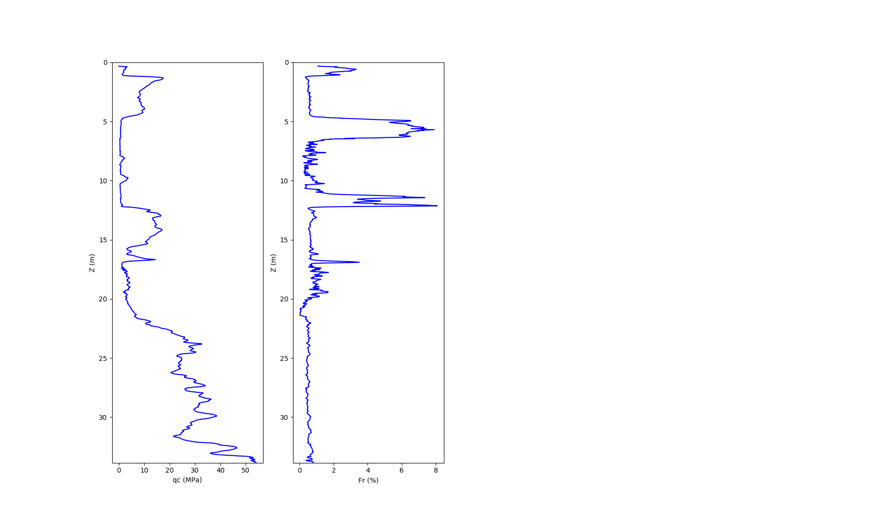

# PYGEF

Simple parser for *.gef files. These are ASCII based files used for soil properties measurements. 
It can reads both borehole *.gef file and cpt *.gef file. It is also possible to plot cpt files.

## Installation
`$ pip install pygef`

`$ pip install git+https://github.com/ritchie46/pygef.git`

## Usage
```python
from pygef.gef import ParseGEF

# read *.gef file
gef = ParseGEF("./my-gef-file.gef")
print(gef)

# Pandas dataframe is accessible via the `df` attribute
print(gef.df)

# save to csv
gef.df.to_csv("my-file.csv")

# plot cpt file
gef.plot_cpt()

# Some important attributes are the follows:
attributes= [
gef.zid, # height respect to NAP
gef.type, # type of the gef file (borehole or cpt)
gef.x, # x coordinate respect to the reference system
gef.y # y coordinate respect to the reference system
]

```

