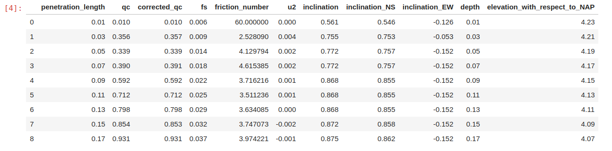
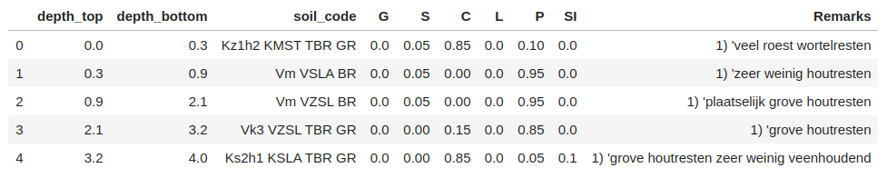
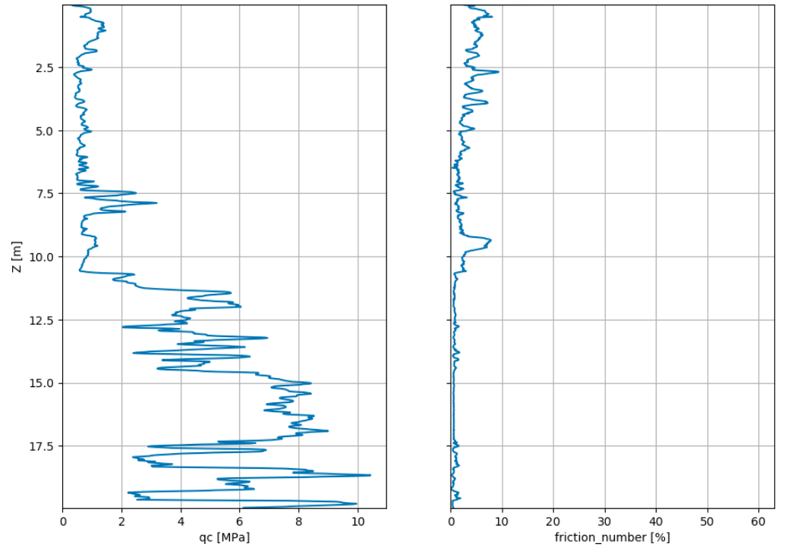
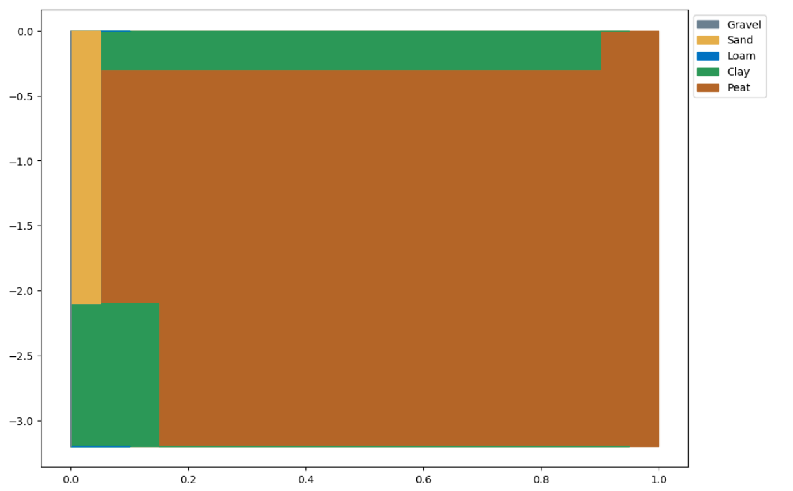
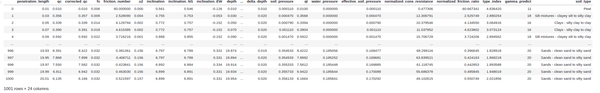
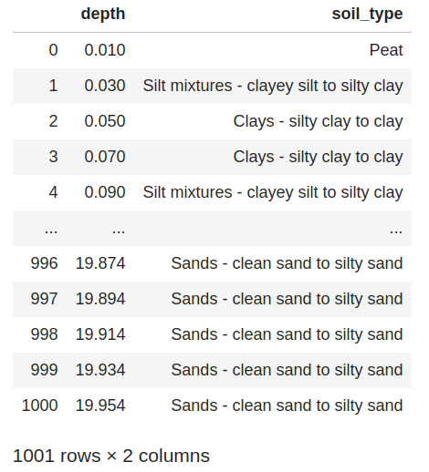
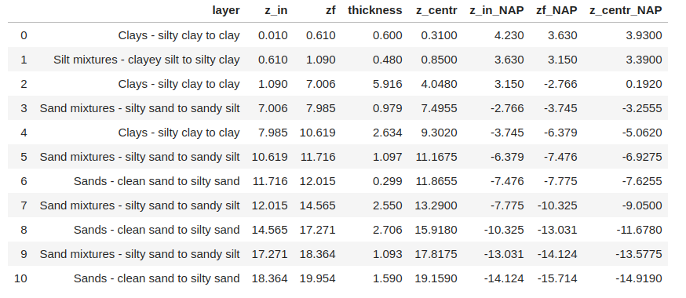
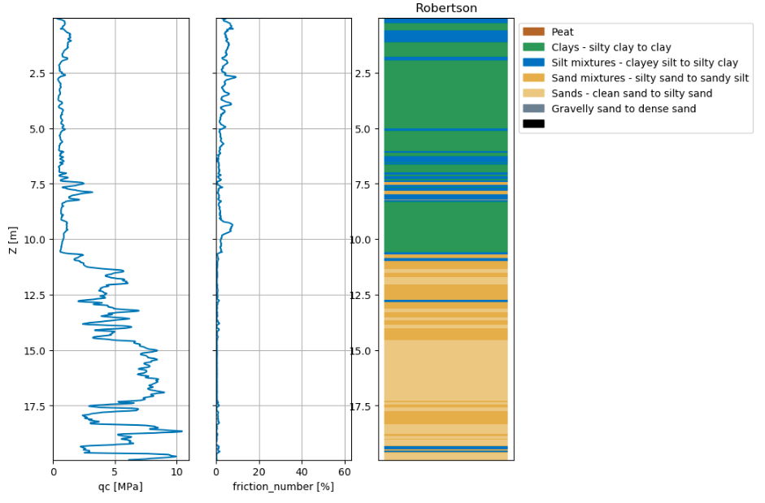
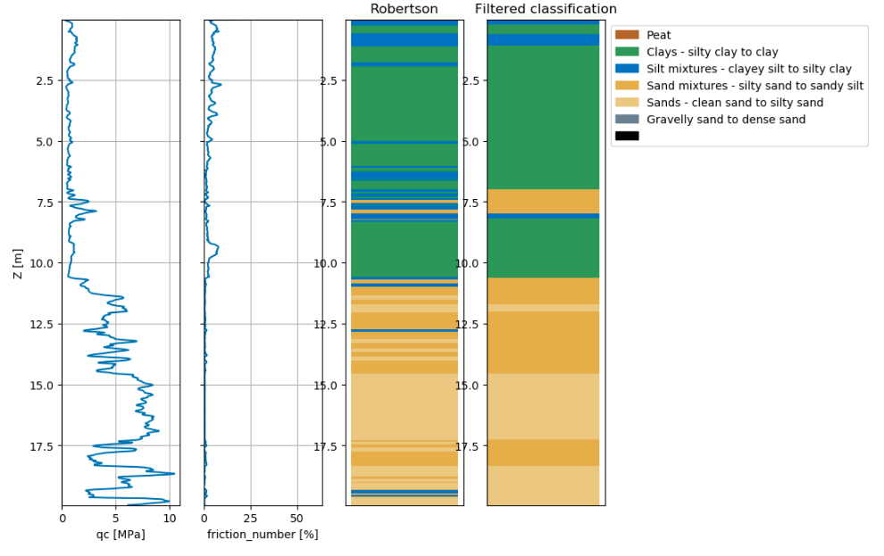

Getting started
===============

Getting started with pygef is easy done in **Nuclei  Notebooks** by importing the :code:`pygef` library:

.. code-block:: python

   from pygef import ParseGEF

or any equivalent :code:`import` statement.

Load a .gef file
-----------------

The class :code:`ParseGEF` accepts two possible inputs:

- the :code:`path` of the .gef file
- the :code:`string` version of the .gef file

If you want to use the :code:`path` then your code should look like this:

.. code-block:: python

    gef = ParseGEF("./path_to_the_gef_file/gef_file.gef")

If you want to use the :code:`string` method:

.. code-block:: python

    with open("./path_to_the_gef_file/gef_file.gef", encoding="utf-8", errors="ignore") as f:
        s = f.read()
    gef = ParseGEF(string=s)

If you get your gef file through the **GEF-MAP** api you will get the gef file as a :code:`string`.
If you want to use :code:`pygef` on that, your code should look like this:

.. code-block:: python

    content = call_endpoint('gef-map', '/map/download/', schema=dict(file_type='gef', gef_id=8262))
    gef = ParseGEF(content)

Access the attributes
---------------------

Accessing the attributes of the pygef object is quite easy.
If for example we want to know the (x, y, z) coordinates of the gef we can simply do:

.. code-block:: python

   coordinates = (gef.x, gef.y, gef.zid)

Check all the available attributes in the reference. Everything(or almost) that is contained in the .gef file it is now
accessible as attribute of the :code:`gef` object.

:code:`ParseGEF` accepts as inputs both a cpt type and a borehole type but the available attributes are different,
check the reference to learn more about it.

A common and very useful attribute is :code:`gef.df`, this is a :code:`pandas.DataFrame` that contains all the rows and
columns defined in the .gef file.

cpt
...
If we call :code:`gef.df` on a :code:`cpt` object we will get something like this:

.. code-block:: python

    gef.df

The number and type of columns depends on the columns originally present in the cpt.

The columns :code:`penetration_length`, :code:`qc`, :code:`depth` are always present.

Suggestion: Instead of using the column :code:`penetration_length` use the column :code:`depth` since this one is corrected with the inclination (if present).

borehole
........
If we call :code:`gef.df` on a :code:`bore` object we will get something like this:

.. code-block:: python

    gef.df

Plot a gef file
---------------

We can plot a .gef file using the method :code:`.plot()`, check the reference to know which are the arguments of the method.

cpt
...
If we use the method without arguments on a :code:`cpt` object we get:

.. code-block:: python

    fig = gef.plot()

borehole
.........
If we use the method without arguments on a :code:`bore` object we get:

.. code-block:: python

    fig = gef.plot()

Classify a cpt
--------------

We can classify a :code:`cpt` object using the method :code:`.classify()`.
The available classification are:

- Robertson(1990) and Robertson(2016)
- Jefferies&Been: available only if :code:`u2` is in the columns of :code:`gef.df`.

It is possible to use the old (1990) or new(2006) implementation of Robertson.

Robertson(1990):

.. math::
    \begin{align}
    I_c = \sqrt{(3.47 - \log Q_t )^2 + (\log F_r + 1.22)^2}
    \end{align}

where:

.. math::
    \begin{align}
    Q_t &= \frac{q_t - \sigma_{vo}}{\sigma_{vo}'}, \\
    F_r &= \frac{f_s}{q_t - \sigma_{vo}} \times 100, \\
    \end{align}

.. math::
    \begin{align}
    q_t =
    \begin{cases}
    q_c + u_2 (1 - a), & \text{if} \> u_2 \neq 0 \\
    q_c                & \text{otherwise}
    \end{cases}
    \end{align}

Robertson(2006):

.. math::
    \begin{align}
    I_c = \sqrt{(3.47 - \log Q_t )^2 + (\log F_r + 1.22)^2}
    \end{align}

where:

.. math::
    \begin{align}
    Q_t &= \frac{q_t - \sigma_{vo}}{p_a}(\frac{p_a}{\sigma_{vo}'})^n, \\
    n &= 0.381 \times I_c + 0.05 \frac{\sigma_{vo}'}{p_a} - 0.15, \\
    F_r &= \frac{f_s}{q_t - \sigma_{vo}} \times 100, \\
    \end{align}

.. math::
    \begin{align}
    q_t =
    \begin{cases}
    q_c + u_2 (1 - a), & \text{if} \> u_2 \neq 0 \\
    q_c                & \text{otherwise}
    \end{cases}
    \end{align}

The implementation given by Jefferies&Been is the following:

.. math::
    \begin{align}
    I_c = \sqrt{(3 - \log (Q_t \times(1 - u_2) + 1))^2 + (1.5 +1.3 \times \log F_r)^2}
    \end{align}

where:

.. math::
    \begin{align}
    Q_t &= \frac{q_t - \sigma_{vo}}{\sigma_{vo}'}, \\
    F_r &= \frac{f_s}{q_t - \sigma_{vo}} \times 100, \\
    q_t &= q_c + u_2 (1 - a)
    \end{align}

The classification is done for each row of the cpt, and you can get the result for each row.

However, it is also possible to apply a grouping algorithm on the cpt, if you set :code:`do_grouping` to :code:`True`,
and specify the :code:`min_thickness` for a layer to be considered, you will get back a much shorter :code:`pandas.DataFrame` with the grouped layers.

Check the reference to learn about all the arguments of the method.

Robertson classification without grouping
.........................................

To get the classification we need to at least pass the attribute :code:`classification` and the water level.
The water level can be given either as :code:`water_level_NAP` or :code:`water_level_wrt_depth`.

.. code-block:: python

    df = gef.classify(classification="robertson", water_level_NAP=-1)

The classification is given for each row of the cpt, all the parameters(Qt, qt, Bq, ecc..) used for the classification are also returned with the
:code:`pandas.DataFrame`.

If you don't want to have so many columns you can just make a selection of them:

.. code-block:: python

    df = gef.classify(classification="robertson", water_level_NAP=-1)
    df[["depth", "soil_type"]]

Robertson classification with grouping
.........................................
We can also apply the grouping algorithm to get a series of layers.

The grouping is a simple algorithm that merge all the layers with :code:`thickness` < :code:`min_thickness`
with the last layer with :code:`thickness` > :code:`min_thickness`.

In order to not make a big error do not use a value for the :code:`min_thickness` bigger then 0.2 m and check the classification made for each row.
The :code:`.plot()` method can be useful for this. (See example below)

.. code-block:: python

    df = gef.classify(classification="robertson", do_grouping=True, min_thickness=0.2, water_level_NAP=-1)

Plot a classified cpt
---------------------

Passing the argument :code:`classification` to the :code:`.plot()` method a subplot with a classification is added.

.. code-block:: python

    fig = gef.plot(classification="robertson", water_level_NAP=-1)
    fig

If we pass also the arguments :code:`do_grouping` and :code:`min_thickness` we can plot next to it a subplot with the grouped classification.

.. code-block:: python

    fig = gef.plot(classification="robertson", do_grouping=True, min_thickness=0.15,  water_level_NAP=-1)
    fig

Check the reference to learn about all the arguments of the method, you can for example control the grid and the figure size.

